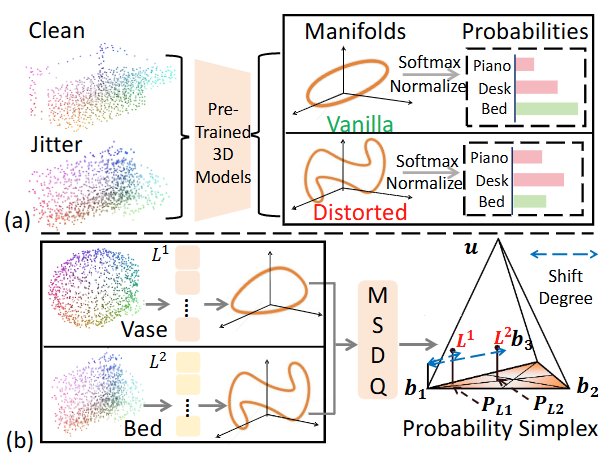

# PGMC

# Overview
In point-cloud representation learning, the encoder maps raw data to high-dimensional feature manifolds and projects them onto low-dimensional semantic manifolds. Corruptions distort this geometric consistency, requiring robust models to calibrate manifold shift. 
    To this end, we propose a novel robust point-cloud representation framework, termed **P**robabilistic **G**eometry-based **M**anifold **C**alibration (**PGMC**), which leverages geometric unity on the probability simplex to restore distorted manifold mapping dynamically. 
    Specifically, our proposed PGMC method integrates three key components:
    (1) A Manifold Shift Degree Quantification module that filters out reliable manifold anchors through mapping different manifolds to the probability simplex. 
    (2) A Hybrid Calibration Memory module that discretely stores global discriminative anchors and continuously refines local geometry.
    (3) A Dual Manifold Calibration strategy, which employs a geometry-preserved manifold to anchor the ideal semantic structure and a shift-aware manifold to capture distortions. 
    By combining different pre-training models, we evaluate our method on three challenging benchmarks for point-cloud corruption and domain shift. 
    Extensive experiments demonstrate that our PGMC method outperforms existing state-of-the-art methods, significantly enhancing the robustness of pre-trained representation models.

   

# Framework
Overview of the proposed PGMC framework. The Discrete Calibration Memory (DCM) and Continuous Calibration Memory (CCM) preserve discrete and continuous geometric semantics, respectively, while the Geometric Preserved Manifold (GPM) and Shift Aware Manifold (SAM) serve as dual calibration spaces to refine the final manifold representation.


    

# Pre-trained Weights and Datasets

Please download the pretrained weights of the four multimodal 3D encoders as well as the datasets from  
the official code of “Point-Cache: Test-time Dynamic and Hierarchical Cache for Robust and Generalizable Point Cloud Analysis”.

Place the corresponding weight paths into the appropriate functions in `utils/utils.py`,  
e.g., `load_ulip`.

Replace all occurrences of `path/to/data` in the configs in `utils/utils.py` with the actual dataset paths.

---

# Package Setup

The experiments were conducted under the following environment:
 
- **Python:** 3.8.16  
- **PyTorch:** 1.12.0  
- **CUDA:** 11.6  
- **torchvision:** 0.13.0  
- **timm:** 0.9.16  
- **Dassl:** (installed based on the official repository instructions)  
- **pueue & pueued:** 2.0.4  

Make sure all dependencies are installed before running the experiments.

---

# Usage

Taking **ULIP-1** as an example for obtaining results on **ModelNet-C** with *jitter* corruption, run:

> **Note:** Update the `noise_type` inside the `get_original_dataloader` function in  
> `utils/utils.py` to match the corruption type used during inference.

```bash
nohup bash ./scripts/main.sh 0 ulip ./pointbert_ulip1.pt modelnet_c obj_only jitter_2 1024 vitg14 ulip1 hierarchical so_obj_only_9 &
