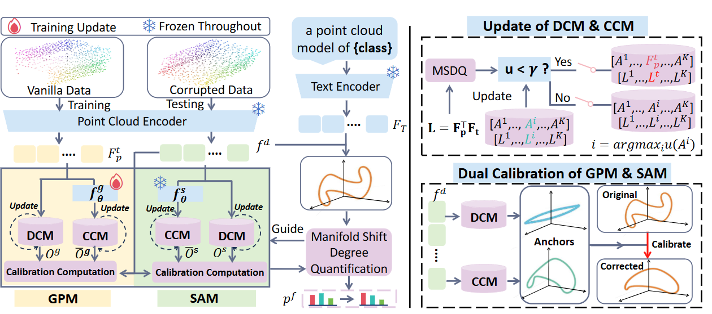

# PGMC

## Overview

In point-cloud representation learning, the encoder maps raw data to high-dimensional feature manifolds and projects them onto low-dimensional semantic manifolds. Corruptions distort this geometric consistency, requiring robust models to calibrate manifold shift.

To this end, we propose a novel robust point-cloud representation framework, termed **P**robabilistic **G**eometry-based **M**anifold **C**alibration (**PGMC**), which leverages geometric unity on the probability simplex to restore distorted manifold mapping dynamically.

Specifically, our proposed PGMC method integrates three key components:

1. A Manifold Shift Degree Quantification module that filters out reliable manifold anchors through mapping different manifolds to the probability simplex.
2. A Hybrid Calibration Memory module that discretely stores global discriminative anchors and continuously refines local geometry.
3. A Dual Manifold Calibration strategy, which employs a geometry-preserved manifold to anchor the ideal semantic structure and a shift-aware manifold to capture distortions.

By combining different pre-training models, we evaluate our method on three challenging benchmarks for point-cloud corruption and domain shift. Extensive experiments demonstrate that our PGMC method outperforms existing state-of-the-art methods, significantly enhancing the robustness of pre-trained representation models.


## Framework

Overview of the proposed PGMC framework. The Discrete Calibration Memory (DCM) and Continuous Calibration Memory (CCM) preserve discrete and continuous geometric semantics, respectively, while the Geometric Preserved Manifold (GPM) and Shift Aware Manifold (SAM) serve as dual calibration spaces to refine the final manifold representation.



PGMC 使用一个入口完成以下实验：

- ModelNet clean / ModelNet-C；
- ScanObjectNN clean / SONN-C；
- Sim2Real；
- FGSM、FGM-L2、PGD-L∞、PGD-L2 对抗攻击；
- ULIP、ULIP-2、OpenShape、Uni3D backbone。

所有命令都在项目根目录运行：

```bash
cd PGMC-clean
python main.py --help
```

攻击实现位于 `pgmc/attacks.py`，攻击快捷脚本位于 `scripts/run_attack.sh`。

## 1. 安装环境

推荐使用原实验环境：Python 3.8.16、PyTorch 1.12.0、CUDA 11.6。

```bash
conda env create -f environment.yaml
conda activate pgmc
```

如果已经安装了匹配的 PyTorch/CUDA：

```bash
pip install -r requirements.txt
```

ULIP、OpenShape 和 Uni3D 均需要 CUDA。

## 2. 下载预训练权重

为了与原实验保持一致，建议使用 Point-Cache/Point-PRC 和各 backbone 官方发布的下列权重。

| Backbone | 需要下载的文件 | 下载地址 |
| --- | --- | --- |
| ULIP-1 point encoder | `pointbert_ulip1.pt` | [Point-PRC / ULIP-1](https://huggingface.co/datasets/auniquesun/Point-PRC/tree/main/pretrained-weights/ulip/point-encoder) |
| ULIP-2 point encoder | `pointbert_ulip2.pt` | [Point-PRC / ULIP-2](https://huggingface.co/datasets/auniquesun/Point-PRC/tree/main/pretrained-weights/ulip-2/point-encoder) |
| ULIP text encoder | `slip_base_100ep.pt` | [Point-PRC / ULIP text encoder](https://huggingface.co/datasets/auniquesun/Point-PRC/tree/main/pretrained-weights/ulip/image-text-encoder) |
| OpenShape point encoder | `model.pt`，使用 `pointbert-vitg14-rgb` | [OpenShape weight](https://huggingface.co/OpenShape/openshape-pointbert-vitg14-rgb/tree/main) |
| OpenShape text encoder | `open_clip_pytorch_model.bin`，ViT-bigG-14 | [LAION OpenCLIP weight](https://huggingface.co/laion/CLIP-ViT-bigG-14-laion2B-39B-b160k/tree/main) |
| Uni3D point encoder | `model.pt`，使用 `uni3d-g` | [BAAI Uni3D weight](https://huggingface.co/BAAI/Uni3D/tree/main/modelzoo/uni3d-g) |
| Uni3D text encoder | `open_clip_pytorch_model.bin`，EVA02-E-14-plus | [EVA02 OpenCLIP weight](https://huggingface.co/timm/eva02_enormous_patch14_plus_clip_224.laion2b_s9b_b144k/tree/main) |

上游项目：

- [ULIP/ULIP-2 official repository](https://github.com/salesforce/ULIP)
- [OpenShape official repository](https://github.com/Colin97/OpenShape_code)
- [Uni3D official repository](https://github.com/baaivision/Uni3D)

下载后按下面方式放置：

```text
PGMC-clean/
`-- weights/
    |-- ulip/
    |   |-- pointbert_ulip1.pt
    |   |-- pointbert_ulip2.pt
    |   `-- slip_base_100ep.pt
    |-- openshape/
    |   |-- model.pt
    |   `-- open_clip_pytorch_model.bin
    `-- uni3d/
        |-- model.pt
        `-- open_clip_pytorch_model.bin
```

## 3. 下载数据集

PGMC 同时需要 target benchmark 和 source clean 数据。Target 用于评测，source clean 数据用于训练 PGMC reconstruction adapter 和建立 source cache。

| 用途 | 数据集 | 下载地址 | 状态 |
| --- | --- | --- | --- |
| ModelNet-C target | `modelnet_c`，包含 `clean.h5` 和 corruption H5 | [Point-PRC ModelNet-C](https://huggingface.co/datasets/auniquesun/Point-PRC/tree/main/new-3ddg-benchmarks/xset/corruption/modelnet_c) | 可直接下载 |
| SONN-C target | `sonn_c/{obj_only,obj_bg,hardest}` | [Point-PRC SONN-C](https://huggingface.co/datasets/auniquesun/Point-PRC/tree/main/new-3ddg-benchmarks/xset/corruption/sonn_c) | 可直接下载 |
| ModelNet40 source | ModelNet40 HDF5 | [PointNet official repository](https://github.com/charlesq34/pointnet) / [HDF5 archive](https://shapenet.cs.stanford.edu/media/modelnet40_ply_hdf5_2048.zip) | 可直接下载 |
| ScanObjectNN source | 已处理为 `obj_only/obj_bg/hardest/{trainminusval.h5,valid.h5}` | [PGMC_data（百度网盘）](https://pan.baidu.com/s/1NNsqEkLJ5lFNde6QUlVVyQ?pwd=1222) | 提取码 `1222` |
| Sim2Real target | `so_obj_only_9`、`so_obj_bg_9`、`so_hardest_9` | [PGMC_data（百度网盘）](https://pan.baidu.com/s/1NNsqEkLJ5lFNde6QUlVVyQ?pwd=1222) | 提取码 `1222` |
| Sim2Real source | `shapenet_9` | [PGMC_data（百度网盘）](https://pan.baidu.com/s/1NNsqEkLJ5lFNde6QUlVVyQ?pwd=1222) | 提取码 `1222` |

`PGMC_data` 同时提供 PGMC 使用的已处理 ScanObjectNN source、Sim2Real target 和 ShapeNet source。Sim2Real 只评测 ShapeNet → ScanObjectNN-C，不使用 ModelNet source。

## 4. 数据目录

推荐目录如下：

```text
PGMC-clean/
`-- data/
    |-- modelnet_c/
    |   |-- shape_names.txt
    |   |-- clean.h5
    |   |-- add_global_2.h5
    |   |-- add_local_2.h5
    |   |-- dropout_global_2.h5
    |   |-- dropout_local_2.h5
    |   |-- rotate_2.h5
    |   |-- scale_2.h5
    |   `-- jitter_2.h5
    |-- modelnet40/
    |   |-- shape_names.txt
    |   `-- ply_data_*.h5
    |-- sonn_c/
    |   |-- shape_names.txt
    |   |-- obj_only/{clean.h5,*_2.h5}
    |   |-- obj_bg/{clean.h5,*_2.h5}
    |   `-- hardest/{clean.h5,*_2.h5}
    |-- scanobjectnn/
    |   |-- obj_only/{trainminusval.h5,valid.h5}
    |   |-- obj_bg/{trainminusval.h5,valid.h5}
    |   `-- hardest/{trainminusval.h5,valid.h5}
    `-- sim2real/
        |-- so_obj_only_9/
        |-- so_obj_bg_9/
        |-- so_hardest_9/
        `-- shapenet_9/
```

所有 H5 至少需要包含：

```text
data:  [N, P, 3] 或 [N, P, C]
label: [N] 或 [N, 1]
```

## 5. Clean 数据怎么跑

Clean 模式读取 `clean.h5`。

### 5.1 ModelNet clean，ULIP-2

```bash
python main.py \
  --benchmark modelnet_c \
  --corruption clean \
  --backbone ulip \
  --ulip-version ulip2 \
  --checkpoint weights/ulip/pointbert_ulip2.pt \
  --text-checkpoint weights/ulip/slip_base_100ep.pt \
  --data-root data/modelnet_c \
  --source-root data/modelnet40 \
  --device cuda:0
```

Clean target 默认使用 `dropout_global_2` 构造 source clean/noisy pair。需要强制 source 也保持 clean 时，增加：

```bash
--source-corruption clean
```

### 5.2 ScanObjectNN clean

```bash
python main.py \
  --benchmark sonn_c \
  --corruption clean \
  --sonn-variant obj_only \
  --backbone ulip \
  --ulip-version ulip2 \
  --checkpoint weights/ulip/pointbert_ulip2.pt \
  --text-checkpoint weights/ulip/slip_base_100ep.pt \
  --data-root data/sonn_c \
  --source-root data/scanobjectnn \
  --device cuda:0
```

`--sonn-variant` 可选：`obj_only`、`obj_bg`、`hardest`。

## 6. Corruption 怎么跑

PGMC 固定使用 severity 2：

```text
add_global_2
add_local_2
dropout_global_2
dropout_local_2
rotate_2
scale_2
jitter_2
```

### 6.1 单个 ModelNet-C corruption

```bash
python main.py \
  --benchmark modelnet_c \
  --corruption jitter_2 \
  --backbone ulip \
  --ulip-version ulip2 \
  --checkpoint weights/ulip/pointbert_ulip2.pt \
  --text-checkpoint weights/ulip/slip_base_100ep.pt \
  --data-root data/modelnet_c \
  --source-root data/modelnet40 \
  --device cuda:0
```

### 6.2 一次跑完 7 个 ModelNet-C corruption

```bash
python main.py \
  --benchmark modelnet_c \
  --all-corruptions \
  --backbone ulip \
  --ulip-version ulip2 \
  --checkpoint weights/ulip/pointbert_ulip2.pt \
  --text-checkpoint weights/ulip/slip_base_100ep.pt \
  --data-root data/modelnet_c \
  --source-root data/modelnet40 \
  --device cuda:0
```

`--all-corruptions` 只跑 7 个 severity-2 corruption，不包含 clean。

### 6.3 SONN-C

```bash
python main.py \
  --benchmark sonn_c \
  --sonn-variant hardest \
  --corruption rotate_2 \
  --backbone openshape \
  --checkpoint weights/openshape/model.pt \
  --text-checkpoint weights/openshape/open_clip_pytorch_model.bin \
  --data-root data/sonn_c \
  --source-root data/scanobjectnn \
  --device cuda:0
```

将 `--corruption rotate_2` 换成 `--all-corruptions` 即可一次跑完该 variant 的 7 个 corruption。

## 7. Sim2Real 怎么跑

Sim2Real 固定为 ShapeNet source → ScanObjectNN-C target，共三项迁移评测：

- ShapeNet → ScanObjectNN-C (`Obj_Only`)；
- ShapeNet → ScanObjectNN-C (`Obj_BG`)；
- ShapeNet → ScanObjectNN-C (`Hardest`)。

目标域标签不参与 test-time adaptation，只在最后计算 accuracy 时读取。程序支持 H5 和类别文件夹 `.npy` 两种格式。

Target H5 示例：

```text
data/sim2real/so_obj_only_9/
|-- clean.h5
`-- shape_names.txt
```

Target `.npy` 示例：

```text
data/sim2real/so_obj_only_9/
|-- bed/test/*.npy
|-- chair/test/*.npy
`-- ...
```

运行命令：

```bash
python main.py \
  --benchmark sim2real \
  --sim2real-type so_obj_only_9 \
  --backbone ulip \
  --ulip-version ulip2 \
  --checkpoint weights/ulip/pointbert_ulip2.pt \
  --text-checkpoint weights/ulip/slip_base_100ep.pt \
  --data-root data/sim2real \
  --source-root data/sim2real \
  --source-domain shapenet_9 \
  --source-corruption jitter_2 \
  --device cuda:0
```

`--sim2real-type` 可选 `so_obj_only_9`、`so_obj_bg_9`、`so_hardest_9`。把示例中的值替换掉即可运行另外两个 target variant。

`--source-domain shapenet_9` 和 `--source-corruption jitter_2` 是 Sim2Real 默认值，可以省略。目录名中的 `_9` 是原数据包命名，程序不会根据这个后缀猜类别数：类别文件夹模式按实际类别目录排序，H5 模式读取 `shape_names.txt` 或 `classnames.txt`，从而保证 source/target 标签空间一致。

## 8. Adversarial attack 怎么跑

攻击代码：

```text
pgmc/attacks.py
```

支持：

```text
fgsm
fgm_l2
pgd_linf
pgd_l2
```

攻击只修改 XYZ，不修改 RGB。

### 8.1 FGSM

在任意 clean/corruption/Sim2Real 命令后增加：

```bash
--attack fgsm \
--attack-epsilon 0.05
```

### 8.2 PGD-L∞

```bash
--attack pgd_linf \
--attack-epsilon 0.05 \
--attack-steps 10 \
--attack-step-size 0.01
```

完整示例：

```bash
python main.py \
  --benchmark modelnet_c \
  --corruption jitter_2 \
  --backbone ulip \
  --ulip-version ulip2 \
  --checkpoint weights/ulip/pointbert_ulip2.pt \
  --text-checkpoint weights/ulip/slip_base_100ep.pt \
  --data-root data/modelnet_c \
  --source-root data/modelnet40 \
  --attack pgd_linf \
  --attack-epsilon 0.05 \
  --attack-steps 10 \
  --attack-step-size 0.01 \
  --device cuda:0
```

## 9. 如何换 backbone

数据和 PGMC config 不需要改变，只替换 backbone 和权重参数。

### ULIP-1

```bash
--backbone ulip \
--ulip-version ulip1 \
--checkpoint weights/ulip/pointbert_ulip1.pt \
--text-checkpoint weights/ulip/slip_base_100ep.pt
```

### ULIP-2

```bash
--backbone ulip \
--ulip-version ulip2 \
--checkpoint weights/ulip/pointbert_ulip2.pt \
--text-checkpoint weights/ulip/slip_base_100ep.pt
```

### OpenShape

```bash
--backbone openshape \
--checkpoint weights/openshape/model.pt \
--text-checkpoint weights/openshape/open_clip_pytorch_model.bin \
--openclip-model ViT-bigG-14
```

### Uni3D

```bash
--backbone uni3d \
--checkpoint weights/uni3d/model.pt \
--text-checkpoint weights/uni3d/open_clip_pytorch_model.bin \
--pc-model eva_giant_patch14_560 \
--clip-model EVA02-E-14-plus
```

## 10. 如何修改 cache 和超参数

统一配置文件：

```text
configs/pgmc.yaml
```

### Cache 大小

```yaml
cache:
  initial_target_shots: 3
  source_positive_capacity: 25
  source_negative_capacity: 10
  target_positive_capacity: 25
  target_negative_capacity: 10
```

容量是每个预测类别的最大条目数。增大容量会增加显存和运行时间。

### Cache logits

```yaml
cache:
  positive:
    alpha: 2.0
    beta: 3.0
  negative:
    alpha: 0.117
    beta: 1.0
    mask_threshold: [0.03, 1.0]
```

- `alpha`：cache logits 的整体权重；
- `beta`：相似度权重的尖锐程度；
- `mask_threshold`：negative cache 概率掩码范围。

### Adapter

```yaml
adapter:
  epochs: 8
  learning_rate: 0.0001
  weight_decay: 0.00001
  num_heads: 8
  expansion: 4
  dropout: 0.2
```

单次运行可用 `--epochs 12` 覆盖 epochs。

### 最终 logits

```yaml
fusion:
  zero_shot: 1.0
  target_global: 1.0
  target_reconstructed: 1.0
  source_global: 2.0
  source_reconstructed: 2.0
  source_local: 1.0
  target_local: 1.0
```

做 ablation 时把不需要的分量设为 `0.0`，不需要修改 Python 代码。

建议复制一份 config 再调参：

```bash
cp configs/pgmc.yaml configs/pgmc_custom.yaml
python main.py ... --config configs/pgmc_custom.yaml
```

## 11. 输出

默认保存在 `outputs/`：

```text
pgmc.log
<run_id>_adapter.pt
<run_id>_metrics.json
pgmc_summary.json
```

指定输出目录：

```bash
python main.py ... --output-dir outputs/ulip2_modelnet_c
```
